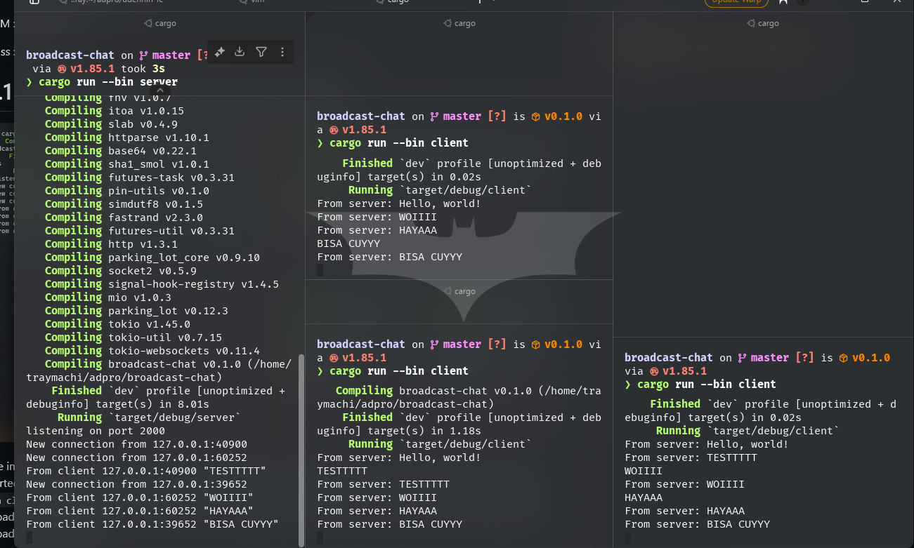
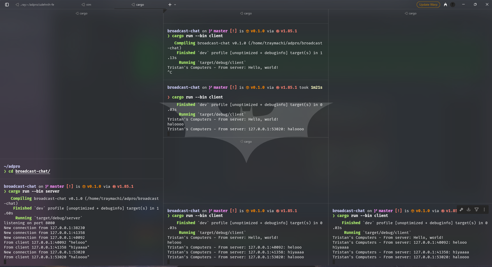

# Broadcast Chat Tutorial Module 10 Adpro - Tutorial 2

Tristan Agra Yudhistira (2306245112)

# 2.1. Original code of broadcast chat.



## How to Run the Broadcast Chat

### Prerequisites

- Make sure you have Rust and Cargo installed
- Ensure port 2000 is not being used by another process

### Running the Server

1. Open a terminal and run:

```bash
cargo run --bin server
```

The server will start listening on port 2000.

### Running the Clients

1. Open three separate terminal windows
2. In each terminal, run:

```bash
cargo run --bin client
```

### How it Works

1. When you start the server, it will print "listening on port 2000"
2. When each client connects, the server will print "New connection from {address}"
3. Each client will receive a "Hello, world!" message upon connection
4. When you type a message in any client:
   - The message will be sent to the server
   - The server will print the message along with the client's address
   - The server will broadcast the message to all connected clients
   - All clients will receive and display the message.

# 2.2 Modifying the websocket port

The broadcast chat system uses WebSocket protocol for real-time communication between the server and clients. The connection details are defined in both the server and client code. The WebSocket protocol is defined in both files using the `tokio_websockets` crate, which provides the WebSocket implementation. The protocol is specified as ws:// in the client's URI, and the server uses the same protocol through the ServerBuilder and ClientBuilder from the same crate.

# 2.3. Adding Sender Information



## Modifications Made to Add Sender Information

### Server-side Changes (server.rs)

1. Modified the broadcast message format to include sender information:

```rust
bcast_tx.send(format!("{}: {}", addr, text))?;
```

This change prepends the sender's address (IP:port) to each message before broadcasting.

### Client-side Changes (client.rs)

1. Added a custom prefix to client messages:

```rust
println!("Tristan's Computers - From server: {}", text);
```

This helps identify messages coming from the server.

### Why These Changes?

1. **Sender Identification**: By including the sender's address (IP:port), each client can now see who sent each message. This is crucial for:

   - Tracking message sources
   - Understanding the flow of communication
   - Debugging connection issues

2. **Message Format**: The format `{sender_address}: {message}` provides a clear separation between the sender information and the actual message content.

3. **Client Branding**: The "Tristan's Computers" prefix in the client output helps distinguish messages in the client's console, making it easier to read and understand the message flow.

### Example Message Flow

1. Client A (127.0.0.1:12345) sends "Hello"
2. Server receives and broadcasts: "127.0.0.1:12345: Hello"
3. All clients receive and display: "Tristan's Computers - From server: 127.0.0.1:12345: Hello"

This modification makes the chat system more informative and easier to debug by providing clear sender information with each message.
